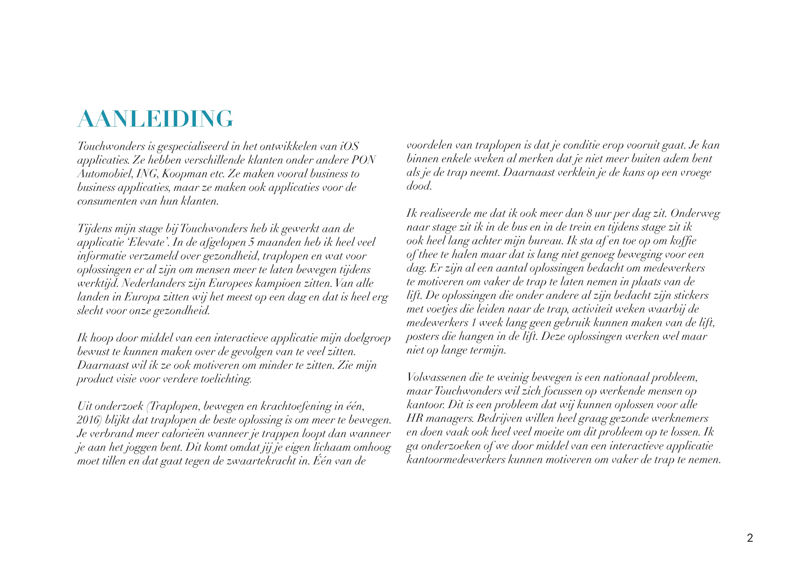
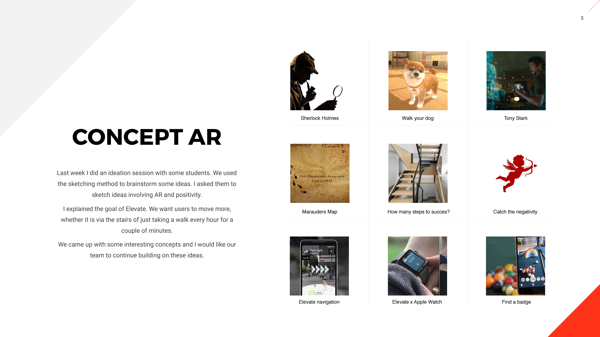
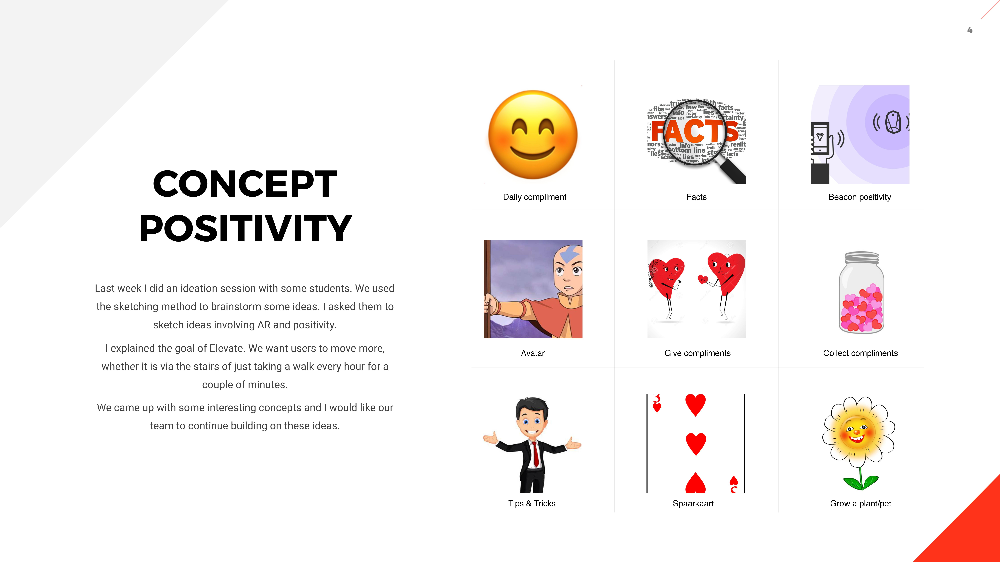
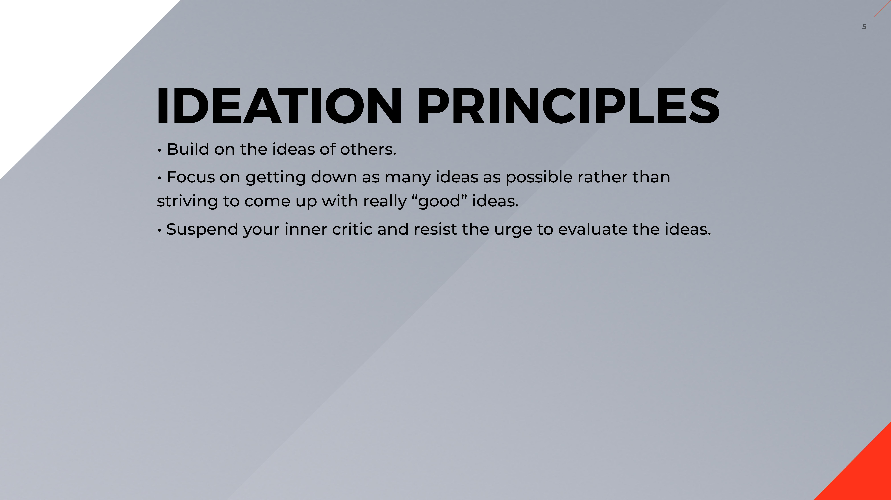
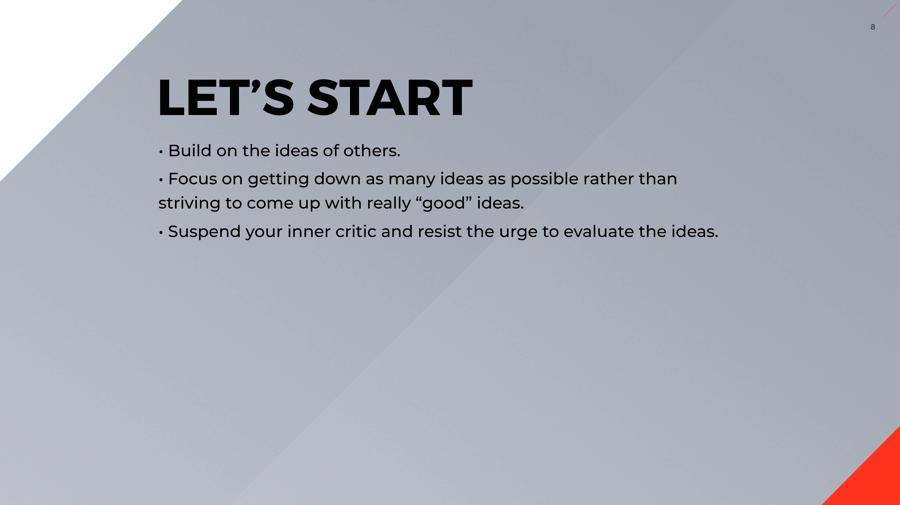
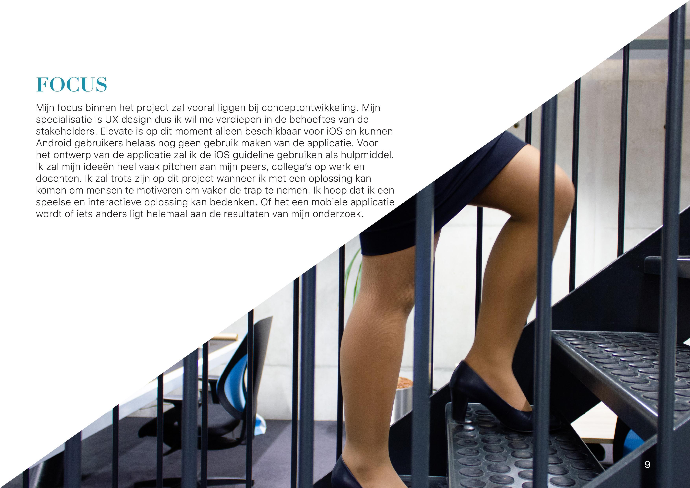
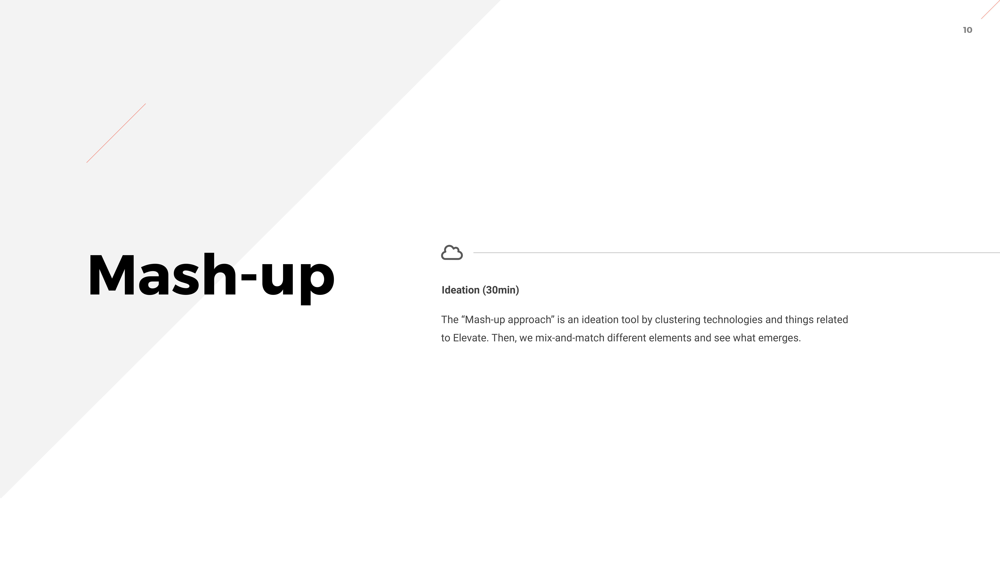

# Designbrief pdf

## Feedback

### Feedback Sjef Smeets

* **Opmerkingen**
  * Ik zou hier toch óók op z'n minst jouw naam hebben verwacht....
  * De standaardkeuze om gedrag te veranderen is belonen of straffen. Welke heeft jou voorkeur?
  * Is dat gelijk voor Hoger- en Lager-\(Anders-\)opgeleiden ?
  * Werkdruk kan erg in de weg zitten. Als je al aan de late kant bent voor een meeting neem je dan drie trappen om bezweet binnen te komen hollen, of neem je dan toch maar de lift...? Hebben HR--managers invloed op zaken als werkdruk ?
  * Een trap \(fysiek\) "leuker" maken hoort dus wel degelijk binnen jouw takenpakket !!
* **Stakeholders**
  * De piano trap is een prachtig idee maar vergt veel onderhoud
* **Design Challenge**
  * Hoe kan een digitale oplossing voor kantoormedewerkers, die tot wel 8 uur per dag zitten, helpen om op een interactieve en laagdrempelige manier te bewegen tijdens kantooruren door middel van o.a gamification?
* **Productvisie**
  * Een ander goed idee is "Wandel-overleg", dwz. dat je gaat wandelen om te overleggen. Tot zo'n 5 personen zou dit geen enkel probleem hoeven zijn. Zelf vaak toegepast met studenten in Leeuwarden. Bijkomend voordeel is dat je gemakkelijker creatief kunt denken dus eerder aan oplossingen kunt komen. \(dat wil ik wel uitleggen, is wetenschappelijk goed onderbouwd.\)
  * onderzoek naar Motivatie? succes hangt vaak af van intrinsieke motivatie, maar die is wel op te starten m.b.v. extrinsieke motivatie, mits goed aangepakt
* **Mogelijke impact**
  * Veel bewegen is OK, teveel wordt iets anders, wedstrijdjes trappenlopen bv. kunnen leiden tot struikelen en lichamelijke ongemak. Sporten is gezond, maar een deel zit 's maandags thuis vanwege 't voetballen in 't weekend...
* **Hoe kan ik mensen bewust maken van de gezondheidsrisico’s die verbonden zijn aan te veel zitten en te weinig bewegen?**
  * Dat is iets héééél anders dan bewegen leuker maken...!!! \(zou dat zelf eerder 'Aftersales' inzetten.

