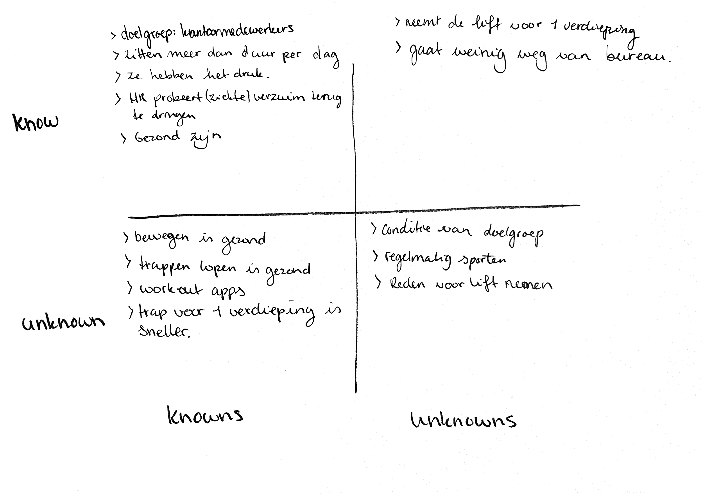

# Empathy map

De Empathy map is gebaseerd op de gesprekken met mensen op kantoor. Mensen die ik op de gang heb gesproken, maar ook mensen die ik op de campus ben tegen gekomen.

Voor deze methode heb ik opgeschreven wat ik al wist. Dit noem ik de 'known knowns', dit is een methode die ik heb geleerd via de design thinking methode. Bij deze methode kun je ook de 'known unknowns', 'unkown knowns' en 'unknowns unkwons' opschrijven. 

De known knowns zijn informatie waar we bewust van zijn en begrijpen. De known unknowns zijn informatie waar we bewust van zijn maar niet begrijpen. De unknown knowns zijn dingen die we begrijpen maar niet bewust van zijn en de unknown unknowns zijn informatie waar we niet bewust van zijn en ook niet begrijpen.

#### Zie de [notities gesprekken](https://s-sontoidjojo.gitbook.io/productbiografie/designbrief/gedrag-onderzoek/notities-gesprekken) en [fly on the wall](https://s-sontoidjojo.gitbook.io/productbiografie/designbrief/gedrag-onderzoek/fly-on-the-wall) dit zijn de tools die gebruikt zijn om deze methode in te vullen. Deze methode is gebruikt om te empathizen met de doelgroep.

