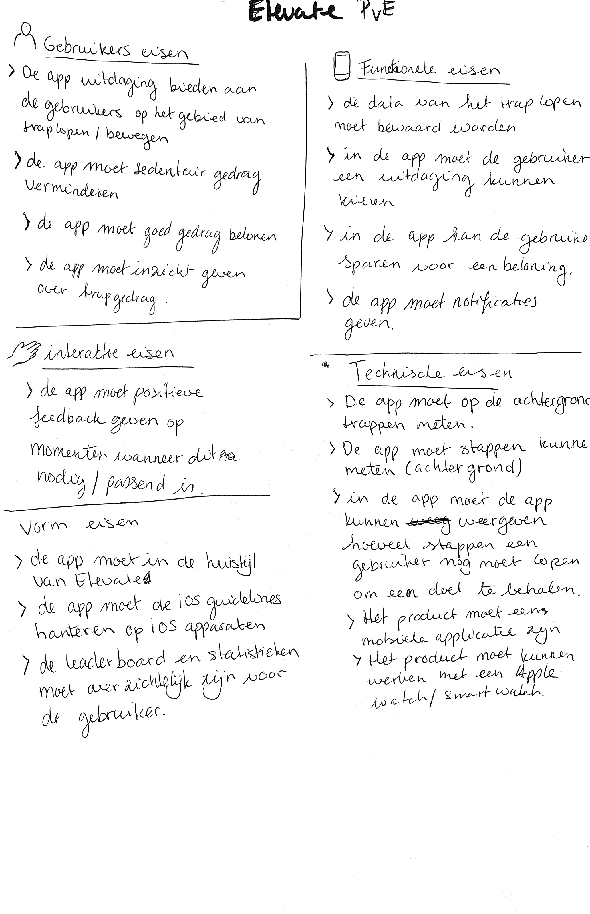

# Programma van Eisen

### Gebruikers eisen

* De app biedt uitdagingen aan de gebruikers op het gebied van traplopen/bewegen
* De app moet sedentair gedrag verminderen
* De app moet goed gedrag belonen
* De app moet inzicht geven over trapgedrag

### Interactie eisen

* De app moet positieve feedback geven op momenten wanneer dit nodig/passend is

### Vorm eisen

* De app moet in de huisstijl van Elevate
* De app moet de iOS guidelines hanteren op iOS apparaten
* De leaderboard en data moeten overzichtelijk zijn voor de gebruiker

### Functionele eisen

* De data van traplopen moeten bewaard worden
* In de app moet de gebruiker een uitdaging kunnen kiezen
* In de app kan de gebruiker sparen voor een beloning
* De app moet notificaties geven

### Technische eisen

* De app moet op de achtergrond trappen meten
* De app moet stappen kunnen meten
* De app moet kunnne weergeven hoeveel trappen de gebruiker nog moet lopen om een doel te behalen
* Het product moet een mobiele applicatie zijn
* Het product moet kunnen werken met een Apple watch/ Smart watch

