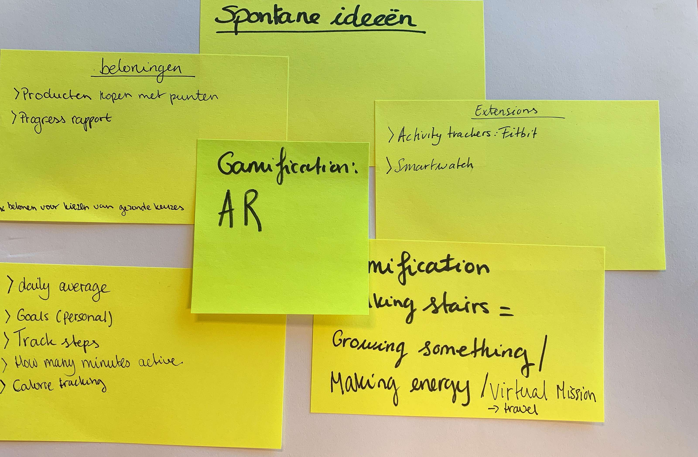

# Ideation

Met het team van Touchwonders heb ik eerst brainopeners gebruikt om op te warmen zoals de methoden 'Yes and..' en de 'Cover Story Vision'. Vervolgens introduceerde ik de methode 'What would google do' aan hun. Ieder persoon had een ander bedrijf en probeerde ideeën te bedenken van uit de perspectief van hun gekozen bedrijf. Nadat alle ideeën gepresenteerd werd aan iedereen en ook die van mijn medestudenten heb ik aan het team gevraagd om goede ideeën bij elkaar toe te voegen of de beste ideeën uit te kiezen. Ik heb ze gevraagd om dit te doen omdat ik een feasability matrix wilde gebruiken om uit te kiezen welke ideeën haalbaar zijn. Ik heb mijn 3 concepten kunnen kiezen door de methode 'Dotmocracy' te gebruiken. Elk teamlid heeft 3 stickers gekregen die ze konden gebruiken om een stem uit te brengen op hun favoriete idee.

