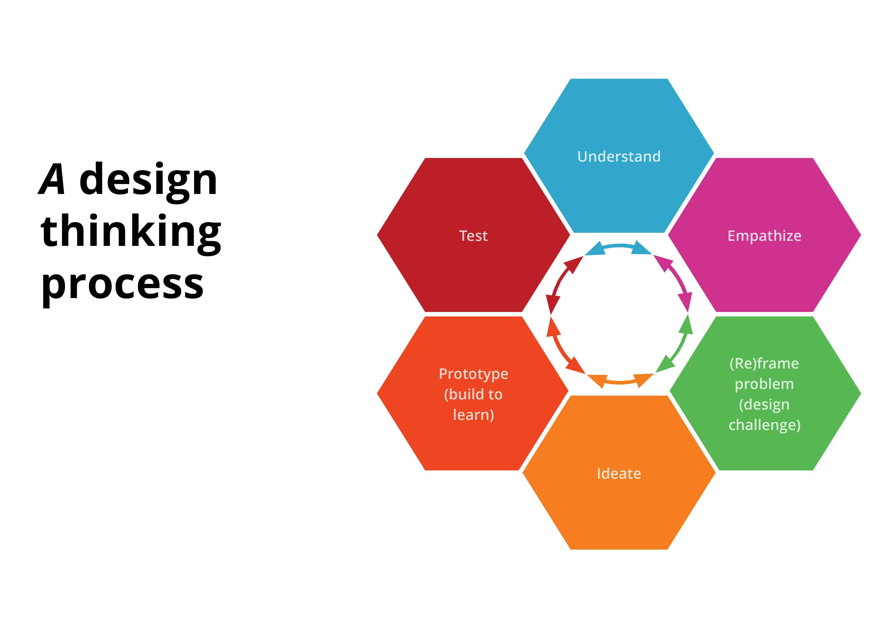

# Fase 3

Fase 3 is het 'Prototype' en 'Test' onderdeel. Tijdens deze fase heb ik gewerkt aan mijn prototype en heb ik een hi-fi prototype getest met de doelgroep. Aan de hand van de feedback en inzichten heb ik het prototype geïtereerd. Daarnaast heb ik ook een expert review gedaan met een UX designer.

