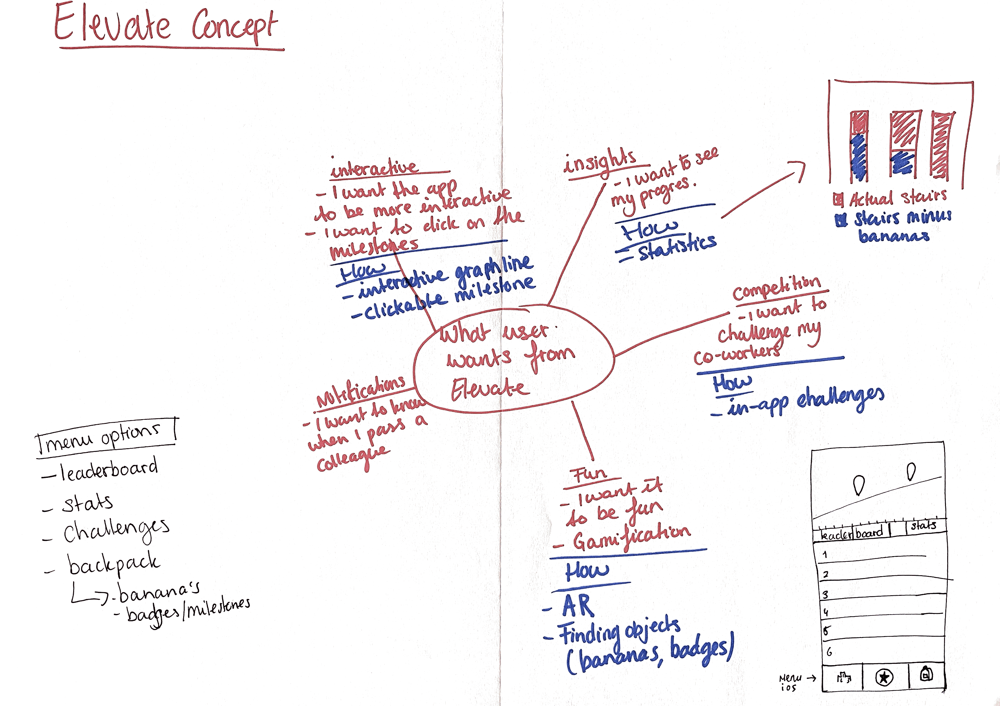
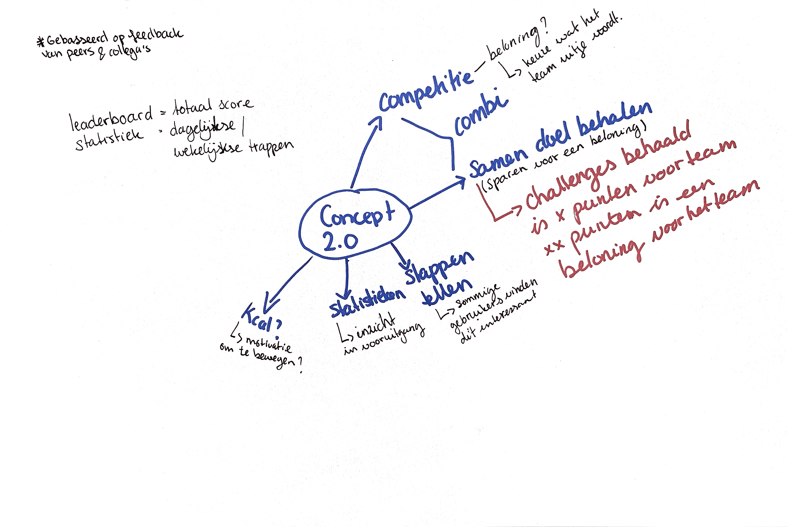

# Brainstormen

Hier ziet u een paar woordwebben maar ook matrix met de gekozen concepten. Via de methode 'dotmocracy' is er gestemd om de concepten met het meeste potentieel aan de hand van de inzichten die ik al had. 

