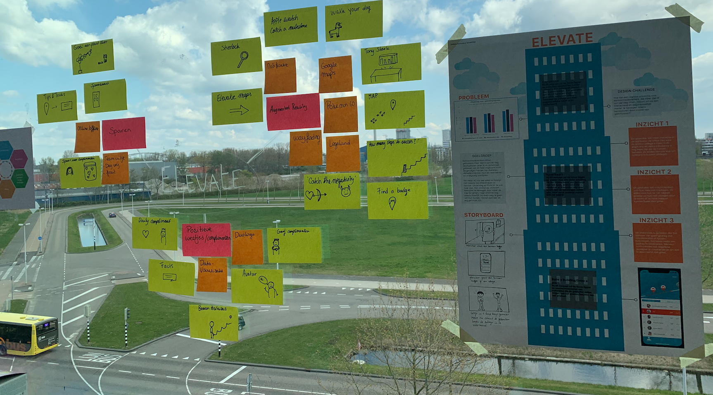

# Ideation team Touchwonders

## Foto's ideation

![Afbeelding \[..\]](../.gitbook/assets/screenshot-2019-06-08-at-14.07.03.png)

![Afbeelding \[..\]](../.gitbook/assets/screenshot-2019-06-08-at-14.05.04.png)

![Afbeelding \[..\]](../.gitbook/assets/screenshot-2019-06-08-at-14.05.41.png)

## Cover Story Vision

![Afbeelding \[..\]](../.gitbook/assets/scannable-document-10-on-10-may-2019-at-16_50_30.png)

![Afbeelding \[..\]](../.gitbook/assets/scannable-document-9-on-10-may-2019-at-16_50_30.png)

![Afbeelding \[..\]](../.gitbook/assets/scannable-document-8-on-10-may-2019-at-16_50_30.png)

## What would Google do?

![Afbeelding \[..\]](../.gitbook/assets/scannable-document-12-on-10-may-2019-at-16_50_30.png)

![Afbeelding \[..\]](../.gitbook/assets/scannable-document-13-on-10-may-2019-at-16_50_30.png)

![Afbeelding \[..\]](../.gitbook/assets/scannable-document-11-on-10-may-2019-at-16_50_30.png)

![Afbeelding \[..\]](../.gitbook/assets/scannable-document-7-on-10-may-2019-at-16_50_30.png)

![Afbeelding \[..\]](../.gitbook/assets/scannable-document-6-on-10-may-2019-at-16_50_30.png)

![Afbeedling \[..\]](../.gitbook/assets/scannable-document-5-on-10-may-2019-at-16_50_30.png)

![Afbeelding \[..\]](../.gitbook/assets/scannable-document-3-on-10-may-2019-at-16_50_30.png)

![Afbeelding \[..\]](../.gitbook/assets/scannable-document-4-on-10-may-2019-at-16_50_30.png)

