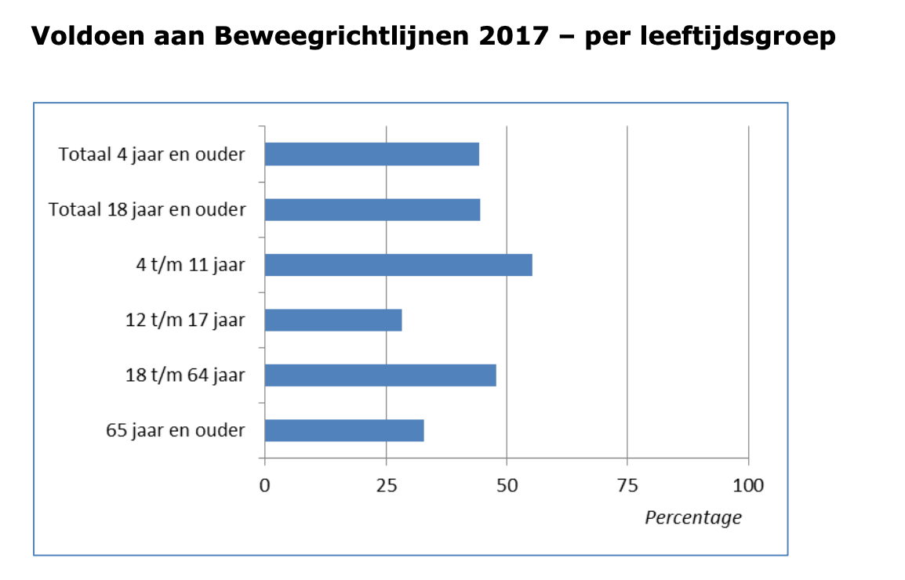
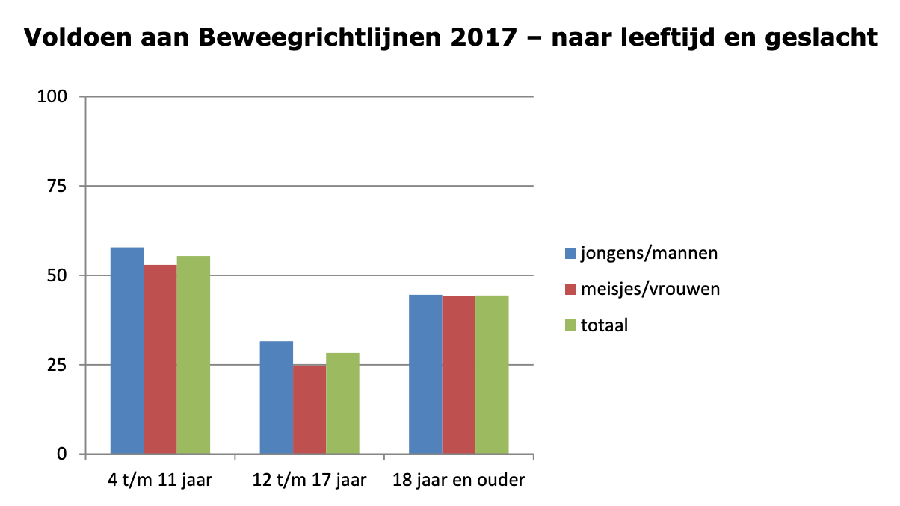

# Onderzoeksvragen: gezondheid

## Hoeveel procent van de Nederlanders voldoet aan de beweegrichtlijn 2017?

Uit recent onderzoek \(Rijksinstituut voor Volksgezondheid en Milieu, n.d.-a\) blijkt dat slechts 44% van de Nederlandse bevolking van 4 jaar en ouder voldoet aan de Beweegrichtlijn 2017.

Zoals u in afbeelding \[..\] kunt zien voldoet bijna de helft van de volwassenen tussen 18 en 64 jaar aan de beweegrichtlijn 2017. 

Zoals u in de bovenstaande afbeelding kunt zien is het percentage dat voldoet aan de beweegrichtlijn nagenoeg gelijk voor mannen en vrouwen die volwassen zijn. 

## Hoeveel moet een volwassene bewegen om te voldoen aan de beweegrichtlijnen 2017?

Ik heb in een artikel van 'Hoeveel moet je bewegen volgens de beweegrichtlijnen?' \(Van Rijn, Wassenaar, & Gelinck, 2017\) gelezen dat de Gezondheidsraad in 2017 advies heeft geschreven over de beweegrichtlijnen voor de minister van VWS \(Volksgezondheid, Welzijn en Sport\). De richtlijnen zijn gebaseerd op een uitgebreide analyse van al het bestaande onderzoek naar gezondheidseffecten van bewegen. De analyse toont ook aan dat er negatieve effecten verbonden zijn aan langdurig en veel zitten. De beweegrichtlijnen geven aan hoeveel je minimaal moet bewegen. De positieve effecten van bewegen werken volgens een continuüm, een stijgende lijn. Een advies dat voor iedereen geldt, ongeacht leeftijd, is om minder te zitten. Te veel zitten heeft namelijke negatieve gezondheidseffecten, maar deze effecten kunnen minder zwaar worden naarmate je meer beweegt. De beweegrichtlijnen adviseren je om je bewust te zijn van je zitgedrag en stilzitten te verminderen, of te minimaliseren.

De beweegrichtlijn voor volwassenen en ouderen is als volgt:

* Bewegen is goed, meer bewegen is beter.
* doe minstens 150 minuten per week aan matig intensieve inspanning, verspreid over diverse dagen. Langer, vaker en/ of intensiever bewegen geeft extra gezondheidsvoordeel.
* Doe minstens tweemaal per week spier- en botversterkende activiteiten
* En: voorkom veel zitten

#### Intensiteit van bewegen

Van Rijn et al. \(2017\) verteld over de verschillende intensiteit van bewegen. Sporten en bewegen kan namelijk met verschillende intensiteit. Hardlopen is intensiever dan wandelen en traplopen is meestal intensiever dan yoga. De intensiteit van bewegen kan je verdelen over 3 categorieën.

* Licht intensieve lichamelijke activiteit: er is geen sprake van verhoogde hartslag of versnelde ademhaling. Voorbeelden hiervan zijn afwassen, musiceren, klussen in huis of bijvoorbeeld yoga.
* Matig intensieve lichamelijke activiteit zorgt voor een verhoogde hartslag en een versnelde ademhaling. Voorbeelden van matig intensieve activiteiten zijn wandelen, fietsen, trampoline springen en traplopen .
* Zwaar intensieve activiteiten zorgt ervoor dat je gaat zweten en buiten adem raakt. Voorbeelden hiervan zijn voetbal, hockey, hardlopen, squash of wielrennen.

Stilzitten \(zitgedrag\) is een aparte categorie, waarbij je helemaal niet beweegt. Hieronder vallen alle activiteiten waarbij je niet of nauwelijks meer energie verbruikt dan in rust. Voorbeelden hiervan zijn activiteiten die je zittend of liggend uitvoert zoals lezen, TV kijken, computeren, gamen of studeren.

## Wat zijn de gevolgen als mensen niet genoeg bewegen?

Uit het artikel 'Wat te veel zitten met je lichaam doet' \(Mol, 2015a\) heb ik gelezen dat de gevolgen van te veel zitten en weinig bewegen een ernstige bedreiging zijn voor de gezondheid. Wanneer je die spieren niet gebruikt wordt het vet en het suiker uit je bloed minder snel opgenomen, en daardoor heb je een hoger risico op hart- en vaatziekten en het ontwikkelen van diabetes.

Uit recent onderzoek \(Van Dommelen et al., 2016\) heb ik gelezen dat te veel zitten de risico's om vroegtijdig te overlijden verhogen. Sedentair gedrag wordt ook geassocieerd met bepaalde kanker soorten, type 2 diabetes, obesitas en hartziekten. Sedentair gedrag is heel erg hoog bij kantoormedewerkers, vooral bij hoogopgeleide vrouwen. Ze concluderen dat een bedrijf zich vooral moet focussen om het verminderen van te lang zitten door matig intensieve bewegen te promoten.

## Wat is de beste manier om meer te bewegen op kantoor via een laagdrempelige manier?

In 2016 schreef Mol een online artikel over de risico’s van sedentair gedrag. Hij verteld dat traplopen makkelijk in te bouwen is in het dagelijks leven en het duurt niet lang. Twee minuten traplopen heeft al een positief effect op de calorieverbranding. Ga je gedurende dag vaker met de trap, dan heeft dit een groot effect op gewicht, cholesterol en bloedglucose. Als je bij elkaar opgeteld 30 minuten matig intensief beweegt per dag dan kan je al voldoen aan de beweegrichtlijnen die opgesteld zijn in 2017 door de gezondheidsraad.\(2016b\)

Het stimuleren van traplopen heeft na 12 weken al een positief effect op fitheid, gewicht en bloeddruk van mensen. Met traplopen verbrand je in kortere tijd meer calorieën dan met joggen: met 30 minuten joggen en 15 min traplopen \(trap óp\) verband je hetzelfde aantal calorieën. Traplopen is een laagdrempelige manier om meer te bewegen op de werkplek te bevorderen.

De MET-waarde van traplopen is 4 wanneer je langzaam de trap op gaat en 8,8 als je snel de trap op gaat. Onderstaande illustratie \(Beck & Van Brussel-Visser, 2016\) geeft in een tabel een duidelijk beeld hoeveel calorieën je verbrand met traplopen. Zie afbeelding \[..\].

Engbers \(2007\) onderzocht hoe je mensen kon stimuleren om vaker de trap te nemen en hij concludeert dat het aantrekkelijk maken van het trappenhuis, het verhogen van de wachttijd bij de lift en voetstapjes naar de trap op de grond plakken, hielpen bij het stimuleren van traplopen.

Bedrijven beginnen vaak vol energie en enthousiasme met het uitvoeren van hun goede voornemens om werknemers te ondersteunen bij hun duurzame inzetbaarheid.

## Hoe motiveren andere landen hun mensen om meer te bewegen?

Uit een artikel van de Volkskrant \(Van Lier, 2013\) bleek dat Rusland zich aan het voorbereiden was op de Olympische winterspelen 2014 door de burgers meer te laten bewegen. Ter promotie van het evenement konden de Russische burgers gratis reizen in ruil voor een beetje lichaamsbeweging. Als het de burgers lukte om 30 squats te doen onder 2 minuten kregen ze een transportkaart. Rusland had meerdere initiatieven zoals hometrainers die elektriciteit produceerden en rekstokken in de bus.

In 2009 schreef Bates over de Piano trap in Stockholm. In één avond had het team van Volkswagen een trap bij een metro getransformeerd in een interactive piano. Elke trede waar een persoon op stapte maakte en geluid. Dit moedigde de mensen aan om de trap te nemen in plaats van de roltrap. Het is een simpele en interactieve oplossing. 

