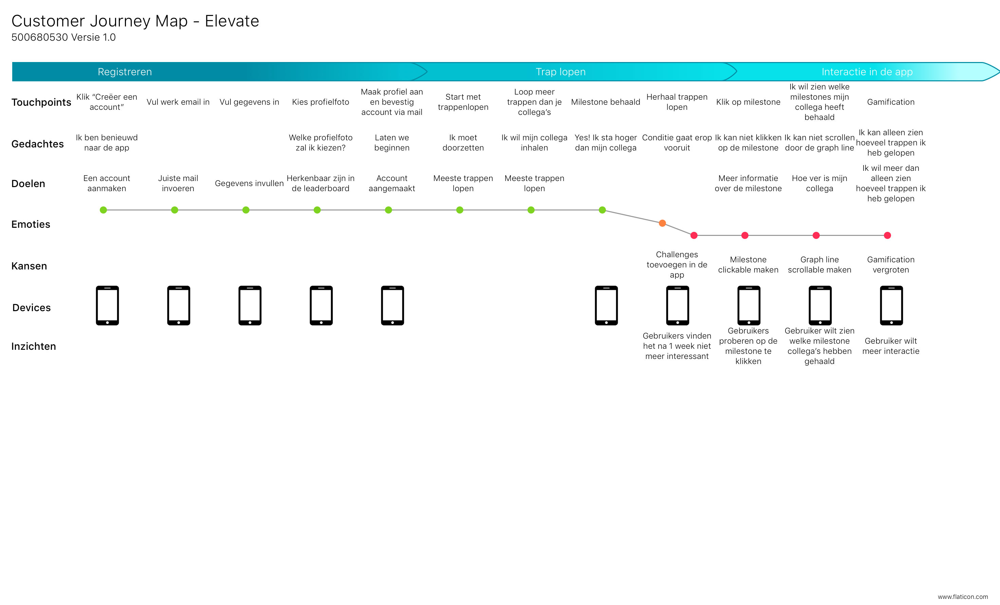
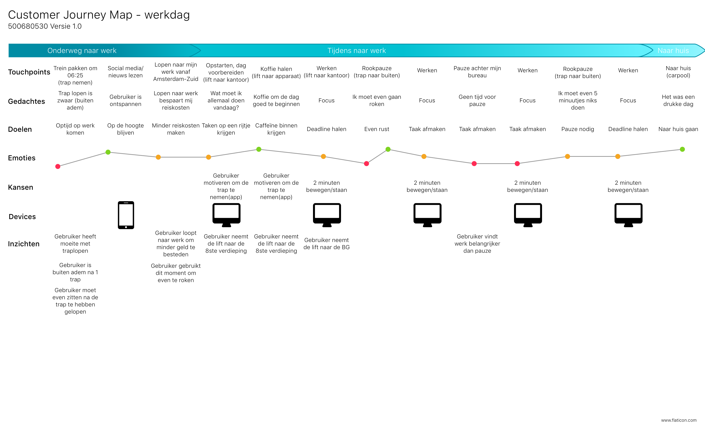

# Customer Journey Map

De Customer Journey Map is gebaseerd op de ervaringen van de testgebruikers. Deze informatie heb ik kunnen halen uit de interviews.

Deze Customer Journey is gebaseerd op een werkdag van een persoon die een normale 9 tot 5 kantoorbaan heeft. 

