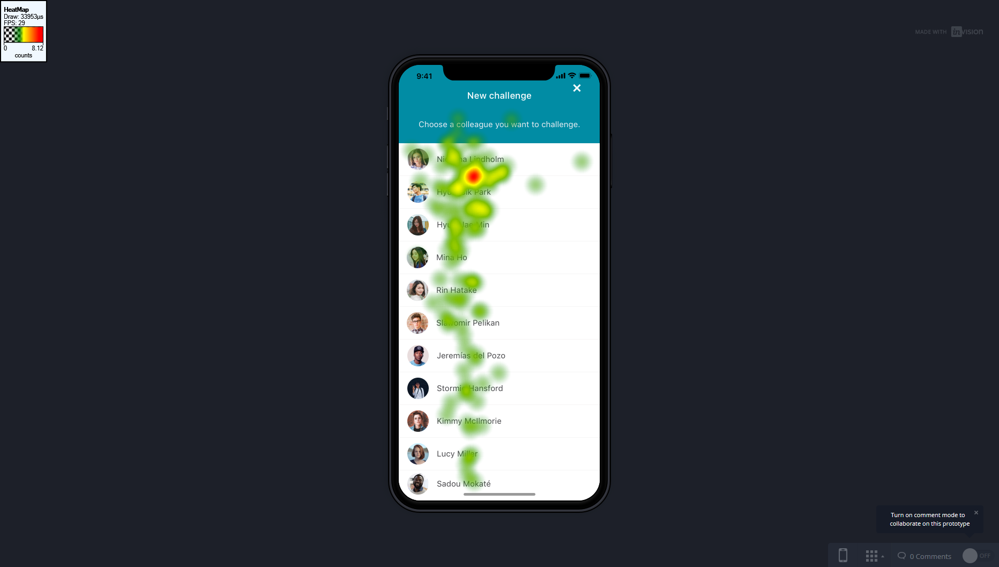

# Heatmaps

Zoals in afbeelding 104 te zien is focussen de testpersonen zich op hun eigen profiel foto. Daarnaast kijken ze het langst naar de segmented control button 'statistieken'.

Op het scherm van de statistieken kijken de testpersonen naar de grafieken en focussen ze zich vooral op de cijfers in de verticale balk. Dit geeft aan dat ze willen weten wat de waardes zijn van de grafieken.

Ik heb gevraagd aan de testpersonen waarom ze zo lang keken naar het profielfoto en de meeste antwoorden door te zeggen dat ze opzoek gaan naar hun eigen gezicht, maar dat ze er snel achter komen dat ze iemand anders zijn tijdens de test. Tijdens deze scherm vinden de testpersonen het ook lastig om de button te vinden om een nieuwe challenge te maken.

Hier zie je dat de gebruikers heel snel scannen door alle namen van de collega's maar met name het langst kijken bij één collega en dat komt omdat ze van mij de opdracht hebben gekregen om die collega te kiezen voor een nieuwe uitdaging.

