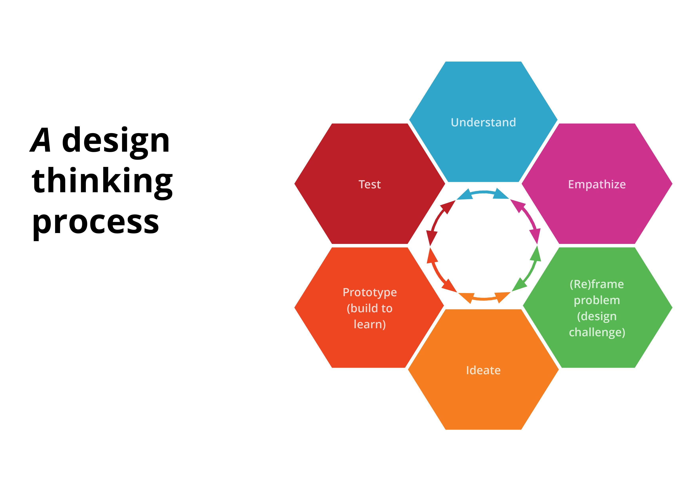

# Fase 1

Voor mijn project heb ik de design thinking proces toegepast. Hierom heb ik mijn project ook in 3 fases opgedeeld. Fase 1 is het 'understand' en 'empathize' onderdeel oftewel de onderzoeksfase.

In fase 1 heb ik twee workshops gevolgd die mij zouden helpen bij het schrijven van mijn designbrief en een goede planning maken voor de komende weken van het afstudeerproject. Ik heb 4 weken ingepland om onderzoek te doen naar mijn doelgroep, concurrenten, gedrag van volwassenen, technologieën en ontwerpmethodes. 

In deze fase vind u mijn designbrief, inzichten van mijn onderzoek en conclusies die ik heb gemaakt aan de hand van mijn onderzoek. Dit onderdeel van mijn project heeft beïnvloed hoe ik mijn ideation fase in ben gegaan en hoe ik tot mijn concept ben gekomen. 

